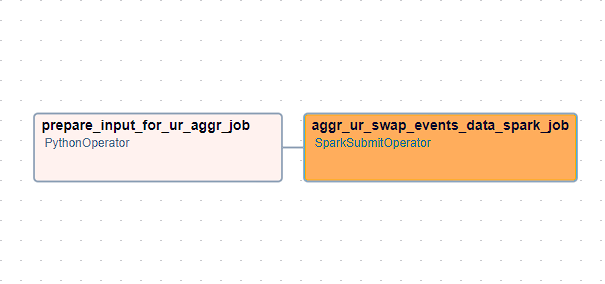

# aggr_ur_swap_events_data

## Graph View


## How to run

1. Open airflow UI or CLI
2. Trigger DAG w/ config:
```conf
{"start_date": "YYYY-MM-DD", "end_date": "YYYY-MM-DD"}
```
DAG has no ```schedule_interval```, can only be triggered manually.

### Sample configs
1. Get data from <2024-03-14, 2024-03-16> date period
```conf
{"start_date": "2024-03-14", "end_date": "2024-03-16"}
```
1. Get data from one day
```conf
{"start_date": "2024-03-14", "end_date": "2024-03-14"}
```