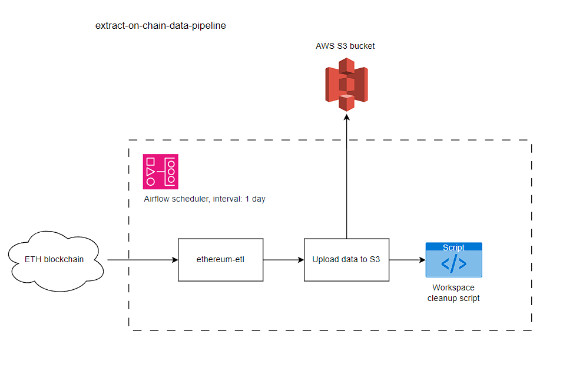
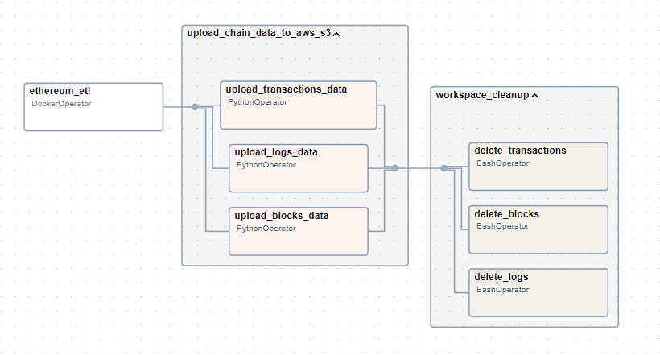

# Extract on-chain data pipeline

### Pipeline architecture

### Components
* Airflow scheduler - Manages and monitors the flow of tasks, triggers the task instances whose dependencies have been met.
* ethereum-etl - Python application, converts blockchain data into convenient formats like CSVs and relational databases.
* Upload data to S3 - Python function, uploads downloaded data to AWS S3 bucket. 
* Workspace cleanup script - Bash script, cleans the working environment after successful upload.

## Airflow graph
