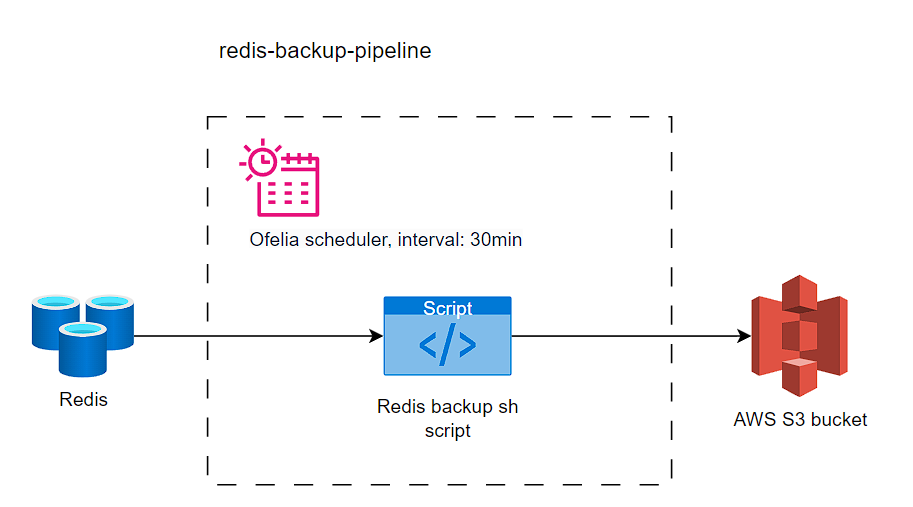

# Redis backup

### Backup process architecture

### Components
* [Ofelia](https://github.com/mcuadros/ofelia) scheduler - Modern and low footprint job scheduler for docker environments, built on Go. 
Ofelia aims to be a replacement for the old-fashioned [<ins>cron</ins>](https://en.wikipedia.org/wiki/Cron).
* Redis backup script - Bash script, creates Redis backup and upload snapshot to AWS S3 bucket.