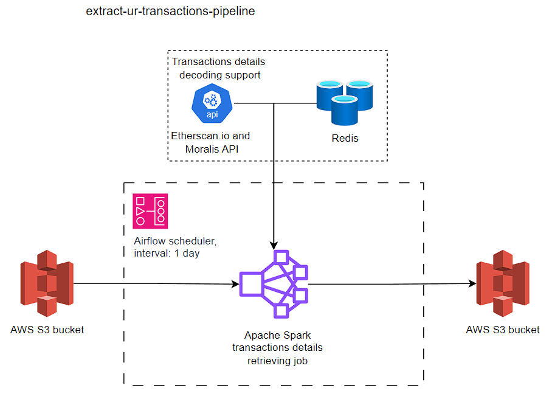
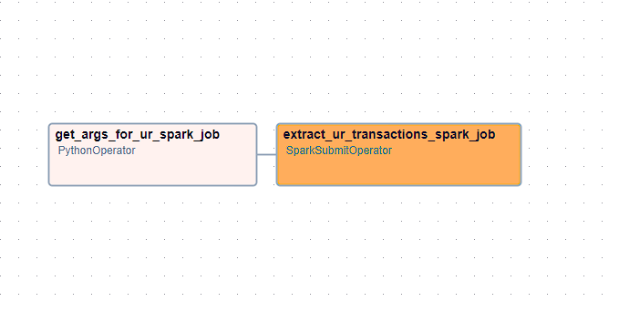

# Extract Universal Router transactions pipeline

The purpose of this pipeline is to filter Ethereum blockchain data in order to extract data that comes 
from the Universal Router contract from the decentralized Uniswap exchange. 
The obtained raw data is then processed in the Apache Spark cluster to extract detailed information 
about transactions from the past.

### Pipeline architecture

### Components
* Airflow scheduler - Manages and monitors the flow of tasks, triggers the task instances whose dependencies have been met.
* Apache Spark cluster - Data processing framework used to process Ethereum Blockchain data in a distributed manner.
* Redis (Remote Dictionary Server) - In-memory data store, used by Spark cluster for retrieving Ethereum contracts ABI (Application Binary Interface).
* Etherscan API - Used for smart contract ABI retrieving if ABI is not present in Redis cache.
The response from the server (missing ABI) is automatically added to the Redis to avoid future requests for the same ABI.

## Airflow graph
